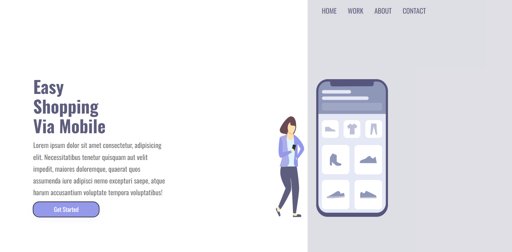
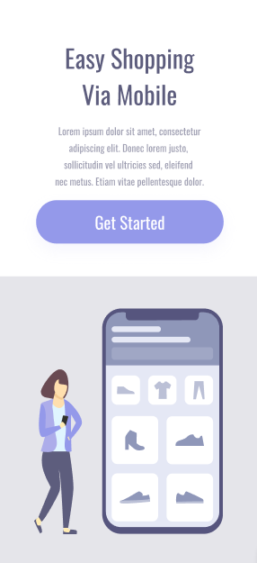

# Easy Shopping

## Site em telas padrões

## Site em telas menores (com resposividade)

## Descrição

Este é um projeto de website chamado **Easy Shopping**. O objetivo do site é oferecer uma experiência de compra fácil e intuitiva via dispositivos móveis.

## Visão Geral do Projeto

O projeto consiste em uma página inicial que apresenta o título do serviço, uma breve descrição e um botão para começar. Há também uma seção lateral com links de navegação e uma imagem ilustrativa.

## Tecnologias Utilizadas

- HTML5
- CSS3
- Google Fonts (Oswald, Montserrat)

## Estrutura do Projeto

O projeto está organizado da seguinte forma:

